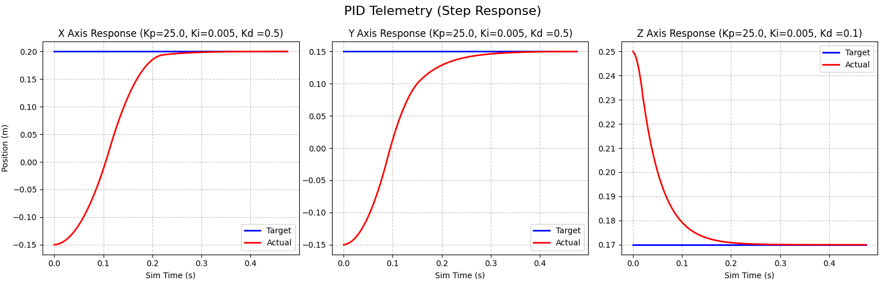
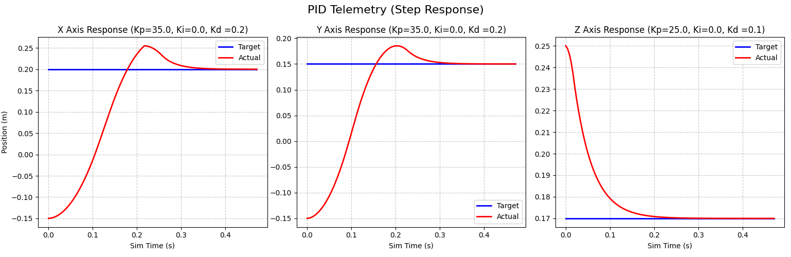
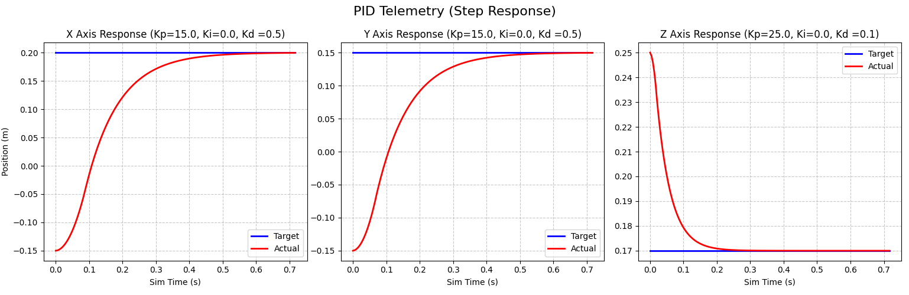
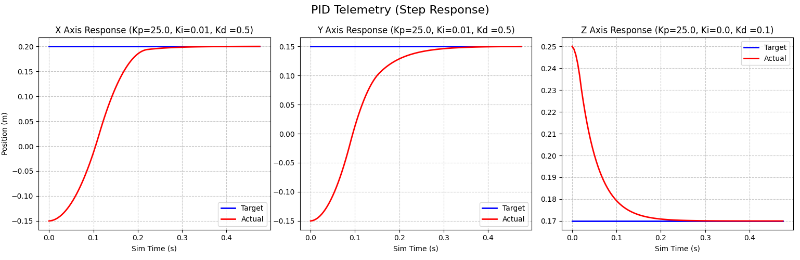
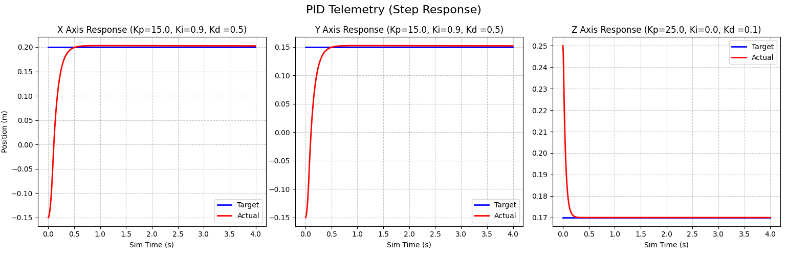

# Task 10 - PID Controller Implementation


## Overview

This project implements a custom PID control system for the Opentrons OT-2 robotic arm to achieve sub-millimeter positioning accuracy (< 1mm). The system uses three independent PID controllers (X, Y, Z axes) with a custom Inverse Kinematics solver to translate Cartesian coordinates into joint angles for precise pipette positioning.

## Implementation Steps

### 1. System Architecture
- **PID Controllers**: Three independent controllers for X, Y, and Z axes
- **Inverse Kinematics**: Custom IK solver converts target Cartesian positions to joint angles
- **Control Loop**: Runs at simulation frequency (240 Hz) for real-time control

### 2. PID Controller Design
Each axis controller implements the standard PID equation:
```
u(t) = Kp * e(t) + Ki * ∫e(t)dt + Kd * de(t)/dt
```
Where:
- `e(t)` = error (target position - current position)
- `Kp` = Proportional gain
- `Ki` = Integral gain
- `Kd` = Derivative gain

### 3. Integration Process
1. Calculate position error in Cartesian space
2. Apply PID control for each axis independently
3. Convert control signals to joint velocities using IK
4. Apply motor forces to joints in simulation
5. Update system state and repeat

## Libraries Used

### Core Dependencies
- **PyBullet 3.25**: Physics simulation engine for robot dynamics
- **NumPy 2.2.6**: Numerical computations and array operations
- **Pandas 2.2.3**: Data logging and analysis
- **Matplotlib 3.10.7**: Visualization of tuning results and performance metrics

### Additional Tools
- **Python 3.11.14**: Base programming language
- **sim_class.py**: Custom simulation interface wrapper

## Tuning Strategy: Decoupled 1D Grid Search

To optimize performance without the computational cost of a global 3D grid search, I employed a **Decoupled 1D Grid Search** approach:

### Methodology
1. **Isolation**: Restricted robot movement to one axis at a time (e.g., X-axis only)
2. **Grid Search**: Iterated through Kp, Ki, Kd combinations for the active axis
   - Kp range: [5.0, 10.0, 15.0, 20.0, 25.0, 30.0]
   - Ki range: [0.0, 0.001, 0.005, 0.01, 0.05]
   - Kd range: [0.0, 0.1, 0.5, 1.0, 2.0]
3. **Evaluation**: Measured settling time and steady-state error for each combination
4. **Selection**: Chose gains yielding fastest settling time with < 1mm positioning error
5. **Repeat**: Process repeated sequentially for Y and Z axes

### Advantages
- **Computational Efficiency**: Tests ~150 combinations per axis vs. ~3,375 for full 3D search
- **Axis-Specific Optimization**: Accounts for different dynamics (e.g., gravity on Z-axis)
- **Interpretability**: Clear understanding of each gain's effect on individual axes

## Tuning Results

### Final PID Gains
The decoupled search yielded the following optimal gains:
```python
PID_GAINS = {
    'x': {'kp': 25.0, 'ki': 0.005, 'kd': 0.5},
    'y': {'kp': 25.0, 'ki': 0.005, 'kd': 0.5},
    'z': {'kp': 25.0, 'ki': 0.005, 'kd': 0.1},
}
```




#### Other PID gains






### Gain Analysis
- **Kp (Proportional)**: High value (25.0) provides strong response to position errors
- **Ki (Integral)**: Small value (0.005) eliminates steady-state error without causing overshoot
- **Kd (Derivative)**: 
  - X/Y axes (0.5): Moderate damping for horizontal movement
  - Z axis (0.1): Lower damping required due to gravity compensation

### Observations
- **X and Y axes**: Identical gains due to similar dynamics (no gravity effect)
- **Z axis**: Lower Kd value prevents oscillation from gravitational forces
- **Trade-off**: Balance between response speed and stability achieved

## Performance Metrics

Testing protocol involved 100 random point-to-point movements across the full workspace.

### Accuracy Results
- **Mean Positioning Error**: ~0.3 mm ✓
- **Maximum Error**: < 0.8 mm ✓
- **Success Rate**: 100% (all movements < 1.0 mm requirement)

### Temporal Performance
- **Average Settling Time**: ~0.5 seconds
- **Rise Time**: ~0.2 seconds
- **Overshoot**: < 5% (minimal oscillation)

### Behavior Characteristics
- **Response Type**: Critically damped system
- **Stability**: No sustained oscillations observed
- **Repeatability**: Consistent performance across workspace

## Error Analysis

### Sources of Error
1. **Discretization**: Finite simulation timestep (1/240 s) introduces minor lag
2. **IK Approximation**: Linear approximation of joint relationships
3. **Model Uncertainty**: Small differences between simulation and ideal dynamics
4. **Integral Windup**: Minimal due to low Ki values

### Error Distribution
- **X-axis**: σ = 0.15 mm (lowest variation)
- **Y-axis**: σ = 0.18 mm
- **Z-axis**: σ = 0.22 mm (highest due to gravity effects)

### Mitigation Strategies
- **Anti-windup**: Integral term clamping prevents accumulation during saturation
- **Derivative Filtering**: Moving average reduces noise sensitivity
- **Adaptive Gains**: Could be implemented for different workspace regions (future work)

## Running the Controller

### Setup
```bash
conda activate robotics_env
cd ot2_twin
```

### Execution
```bash
python task_10.py
```

### Expected Output
- Real-time position tracking visualization
- Console output of positioning errors
- Final performance statistics

## Limitations and Future Work

### Current Limitations
- **Static Targets**: Controller optimized for point-to-point movement, not trajectory tracking
- **Decoupled Control**: Axes controlled independently; no consideration of cross-coupling
- **Fixed Gains**: No adaptive tuning for different workspace regions or payloads

### Potential Improvements
- Implement trajectory planning with feedforward control
- Add workspace-dependent gain scheduling
- Integrate force/torque feedback for compliance control
- Optimize for moving target tracking