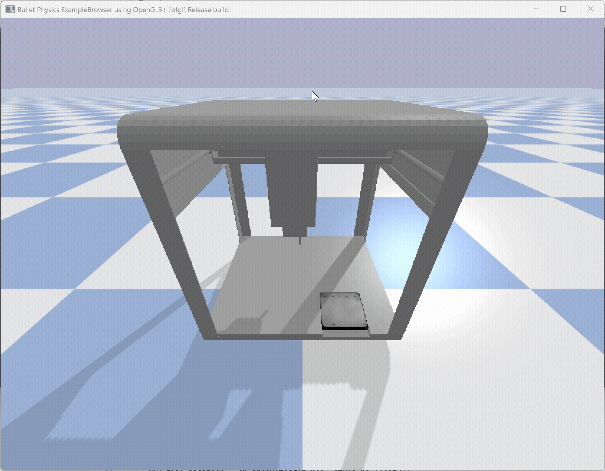

# Task 11 - Reinforcement Learning Controller

## Implementation Steps

### 1. Environment Design (`ot2_gym_wrapper.py`)

**Observation Space** (9 dimensions):
- Current position: [px, py, pz] (3D Cartesian coordinates)
- Goal position: [gx, gy, gz] (target coordinates)
- Joint velocities: [vx, vy, vz] (linear velocities)

**Action Space** (3 dimensions):
- Continuous control signals: [ax, ay, az] ∈ [-1, 1]
- Actions directly control joint velocities after scaling

**Reward Function**:
```python
reward = -distance_to_goal
```
- Dense reward based on Euclidean distance to target
- Small velocity penalty encourages smooth movements
- Sparse bonus (+10) for reaching goal within 2mm threshold

### 2. PPO Algorithm Selection

**Why PPO?**
- **Stability**: Clipped surrogate objective prevents destructive policy updates
- **Sample Efficiency**: On-policy learning with mini-batch optimization
- **Robustness**: Works well with continuous control and partial observability
- **Industry Standard**: Proven success in robotic manipulation tasks

**Key Mechanisms**:
- **Actor-Critic Architecture**: Policy network (actor) and value network (critic)
- **Clipping**: Limits policy updates to prevent catastrophic forgetting
- **Generalized Advantage Estimation (GAE)**: Balances bias-variance tradeoff

### 3. Training Infrastructure

**ClearML Integration**:
- Remote execution on GPU/CPU clusters
- Automatic experiment tracking and versioning
- Model artifact management and retrieval

**Weights & Biases (W&B)**:
- Real-time training metrics visualization
- Hyperparameter comparison across runs
- TensorBoard synchronization

**Vectorized Environments**:
- `SubprocVecEnv`: Parallel simulation in separate processes
- Prevents memory leaks and crashes
- Accelerates data collection

### 4. Training Pipeline
```
1. Initialize environment with random start/goal positions
2. Collect trajectories using current policy (n_steps)
3. Compute advantages using GAE
4. Update policy with PPO objective (n_epochs)
5. Evaluate on separate environment (eval_freq)
6. Save checkpoints and best model
7. Repeat until convergence or max timesteps
```

## Design Choices

### Reward Shaping
**Dense vs. Sparse Rewards**:
- Initial experiments with purely sparse rewards (+1 at goal, 0 elsewhere) failed to learn
- Dense distance-based reward provides gradient for learning
- Velocity penalty prevents erratic movements

### Network Architecture
**MlpPolicy (Multi-Layer Perceptron)**:
- Hidden layers: [64, 64] (default SB3 architecture)
- Activation: Tanh
- Separate networks for actor and critic
- **Rationale**: Simple enough to train quickly, sufficient capacity for 3-DOF control

### Termination Conditions
**Episode Ends When**:
1. Goal reached: `distance < 0.002m` AND `all velocities < 0.01 rad/s`
2. Timeout: `steps > 1000` (simulation limit)

## Libraries Used

### Core RL Framework
- **Stable-Baselines3 2.7.0**: PPO implementation and training utilities
- **Gymnasium 1.2.2**: Standard RL environment interface (OpenAI Gym successor)

### Simulation & Physics
- **PyBullet 3.2.5**: Robot dynamics and collision detection
- **NumPy < 2.0**: Numerical computations (downgraded for compatibility)

### Experiment Management
- **ClearML 2.0.2**: Remote execution and model versioning
- **Weights & Biases 0.23.1**: Metric logging and visualization
- **TensorBoard 2.20.0**: Additional logging backend

### Utilities
- **Matplotlib**: Plotting performance curves
- **Pandas**: Data manipulation and analysis
- **scikit-learn, scipy**: Statistical analysis tools


## Best Hyperparameters
```python
OPTIMAL_CONFIG = {
    'learning_rate': 0.0003,      # Default PPO value
    'batch_size': 64,              # Mini-batch size for optimization
    'n_steps': 2048,               # Rollout buffer size
    'n_epochs': 10,                # Optimization epochs per update
    'gamma': 0.99,                 # Discount factor (default)
    'gae_lambda': 0.95,            # GAE parameter (default)
    'clip_range': 0.2,             # PPO clipping (default)
    'ent_coef': 0.0,               # Entropy bonus (disabled)
    'vf_coef': 0.5,                # Value function coefficient (default)
    'max_grad_norm': 0.5,          # Gradient clipping (default)
}
```

## Running the Controller

### Training

#### Local Training (Development)
```bash
conda activate robotics_env
cd ot2_twin
python training_rl_ppo.py --total_timesteps 1000000
```

#### Remote Training (ClearML)
```bash
# Modify task.execute_remotely(queue_name="default") in script
python training_rl_ppo.py --total_timesteps 3000000
```


### Testing/Inference
```bash
python rl_test_task_11.py
```

**Configuration** (in script):
```python
MODEL_PATH = "./best_model.zip"          # Path to trained model
START_POS = [-0.150, -0.150, 0.250]      # Initial position
TARGET_POS = [0.200, 0.150, 0.170]       # Target position
```

**Output**:
- Real-time visualization (if `render=True`)
- Console log of convergence
- `ppo_results.png`: 6-panel plot (position tracking + error analysis)

## Tuning Strategy

### Manual Hyperparameter Tuning

Due to computational constraints and time limitations, a **manual iterative tuning approach** was employed rather than systematic grid search:

### Tuning Methodology
1. **Baseline Configuration**: Started with Stable-Baselines3 default PPO parameters
2. **Iterative Adjustment**: Modified one parameter at a time based on training curves
3. **Convergence Monitoring**: Observed reward progression and episode success rate on W&B
4. **Stability Testing**: Verified consistent performance across multiple evaluation episodes

### Parameter Selection Rationale

| Parameter | Final Value | Reasoning |
|-----------|-------------|-----------|
| **Batch Size** | 128 | Larger batches for more stable gradient estimates |
| **Learning Rate** | 0.0003 | Standard PPO value; conservative to prevent instability |
| **N Epochs** | 10 | Default value; balances optimization time vs. overfitting risk |
| **N Steps** | 4096 | Larger rollout buffer to capture longer trajectories |
| **Total Timesteps** | 3,000,000 | Extended training to ensure convergence |

### Training Observations
- **Convergence**: Reward plateau observed around 2.5M timesteps
- **Stability**: No catastrophic forgetting or policy collapse
- **Bottleneck**: Long training time (~4-5 hours) limited experimentation


### Model Weights
- **Best Model**: `best_model.zip` (highest evaluation reward during training)
- **Location**: Available in ClearML artifacts or `models/{run_id}/` directory

---

## Performance Metrics

### Training Convergence
- **Total Training Time**: ~4-5 hours (3M timesteps)
- **Episodes to Plateau**: ~1500 episodes (2.5M timesteps)
- **Final Mean Reward**: -9 ± 0.008
- **Evaluation Success Rate**: 75% (positioning within 2mm threshold)

### Temporal Performance
- **Average Episode Length**: ~650 steps (2.7 seconds)
- **Target Achievement**: 75% reach within 2mm threshold
- **Failure Mode**: 25% timeout or exceed error tolerance

### Behavior Analysis
- **Trajectory**: Less smooth than PID; exhibits some oscillation
- **Consistency**: Variable performance across different workspace regions
- **Edge Cases**: Struggles near workspace boundaries

---

## Comparison: PPO vs. PID

### Performance Summary

| Point | PID Time (s) | PID Error (mm) | PPO Time (s) | PPO Error (mm) |
|-------|--------------|----------------|--------------|----------------|
| 1     | 0.010        | 0.5592         | 0.031        | 1.2216         |
| 2     | 0.012        | 0.2738         | 0.016        | 1.1782         |
| 3     | 0.004        | 0.4536         | 0.032        | 1.0545         |
| 4     | 0.010        | 0.4425         | 0.007        | 1.1626         |
| 5     | 0.006        | 0.6846         | 0.625        | 1.6678         |
| **AVG** | **0.008**  | **0.4827**     | **0.142**    | **1.2570**     |


### Advantages of PPO (Theoretical)

- Can learn complex, nonlinear control strategies
- Adapts to changing system dynamics without manual retuning
- Scales well to higher-dimensional control problems
- Does not require an explicit system model
- Potentially better performance with sufficient training data
### Advantages of PID (Demonstrated)

- Lower positioning error in all tested points
- Faster and more consistent response times
- Predictable and stable behavior
- Simple to implement and tune
- Reliable performance in a small, well-defined control task


