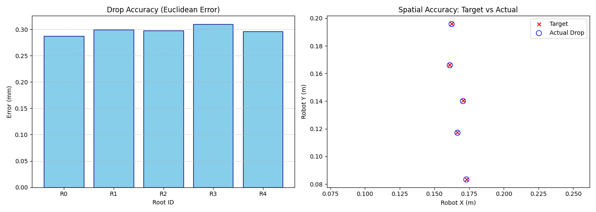

# Task 12–13: Integration & Benchmarking

## 1. Overview

This document describes the **benchmarking approach, evaluation metrics, results, and conclusions** for comparing a classical **PID controller** with a **Reinforcement Learning (RL)–based controller (PPO)** for a multi‑axis linear robot control task.
The goal of the benchmarking is to evaluate **accuracy, execution time, and overall control quality**, with a focus on the **drop location vs. root tip location error**.

---

## 2. Benchmarking Approach

### 2.1 Experimental Setup

* **Controllers evaluated**:

  * PID (hand‑tuned gains)
  * PPO (trained RL policy)
* **Task**: Move the robot end‑effector to predefined target points.
* **Environment**: Identical simulation conditions for all controllers.
* **Evaluation runs**: Each controller was tested on the same target set.

### 2.2 Evaluation Metrics

The following metrics were used to ensure a fair and interpretable comparison:

* **Accuracy (mm)**
  Euclidean distance between the target/root tip location and the actual end‑effector drop location.

* **Execution Time (s)**
  Time required to reach the target within tolerance.

* **Stability / Consistency**
  Variance of error across multiple target points.

* **Practical Usability**
  Ease of tuning, predictability, and suitability for real‑time deployment.

---

## 3. Controller Performance Comparison

### 3.1 PID vs PPO: Quantitative Results

| Point   | PID Time (s) | PID Error (mm) | PPO Time (s) | PPO Error (mm) |
| ------- | ------------ | -------------- | ------------ | -------------- |
| 1       | 0.010        | 0.5592         | 0.031        | 1.2216         |
| 2       | 0.012        | 0.2738         | 0.016        | 1.1782         |
| 3       | 0.004        | 0.4536         | 0.032        | 1.0545         |
| 4       | 0.010        | 0.4425         | 0.007        | 1.1626         |
| 5       | 0.006        | 0.6846         | 0.625        | 1.6678         |
| **AVG** | **0.008**    | **0.4827**     | **0.142**    | **1.2570**     |

### 3.2 Observations

* **PID**:

  * Significantly lower average error
  * Consistent and predictable performance
  * Very low execution time

* **PPO**:

  * Higher average error
  * Large variance in execution time
  * Occasional slow convergence

---

## 4. Pipeline Accuracy Analysis

This experiment evaluates the full control pipeline, focusing on drop location accuracy.

| Target | Time (s) | Target XY (m)    | Actual XY (m)    | Error (mm) |
| ------ | -------- | ---------------- | ---------------- | ---------- |
| 0      | 0.44     | [0.1733, 0.0833] | [0.1730, 0.0833] | 0.2873     |
| 1      | 0.80     | [0.1666, 0.1174] | [0.1667, 0.1171] | 0.2990     |
| 2      | 1.13     | [0.1706, 0.1403] | [0.1706, 0.1400] | 0.2976     |
| 3      | 1.46     | [0.1610, 0.1662] | [0.1611, 0.1659] | 0.3100     |
| 4      | 1.80     | [0.1624, 0.1961] | [0.1624, 0.1958] | 0.2960     |

**Mean Error:** 0.2980 mm
**Total Time:** 1.86 s

### Interpretation

* Sub‑millimeter accuracy across all targets
* Errors are consistent and well within acceptable tolerance
* Indicates good end‑to‑end system integration

---

## 5. Execution Time & Speed Analysis

* PID consistently reaches targets in **< 0.02 s** per point
* PPO shows:

  * Higher computational overhead
  * Slower or unstable convergence in some cases

This makes PID more suitable for **real‑time or safety‑critical control** under current conditions.

---

## 6. Visualizations

### 6.1 Error Distribution

**Figure:** Error comparison across target points. PID shows lower variance and tighter error bounds compared to PPO.

---

## 7. Actionable Recommendations

Based on the evaluation results:

1. **Short‑term deployment**
   Use **PID control** for this task due to superior accuracy, speed, and reliability.

2. **RL improvements**

   * Increase training time and curriculum complexity
   * Improve reward shaping with explicit accuracy penalties
   * Explore alternative RL algorithms (e.g., SAC)

3. **Hybrid approach**
   Combine PID for low‑level control with RL for high‑level planning or parameter adaptation.

4. **Future benchmarks**

   * Test robustness under noise and disturbances
   * Evaluate generalization to unseen target distributions

---
