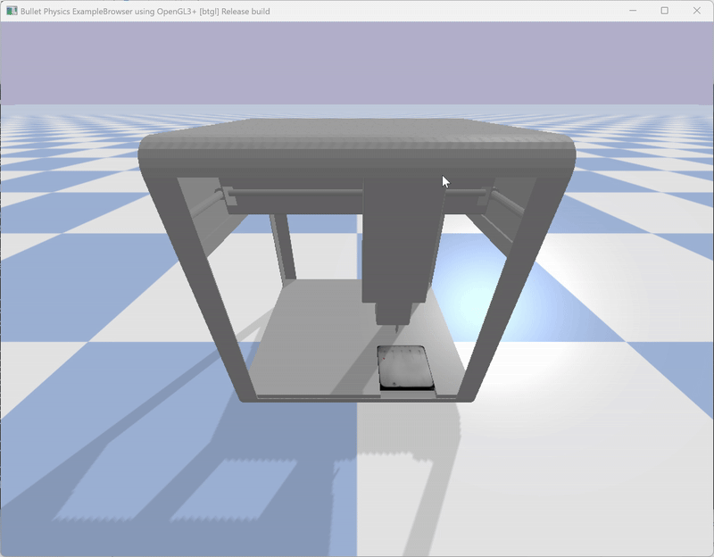
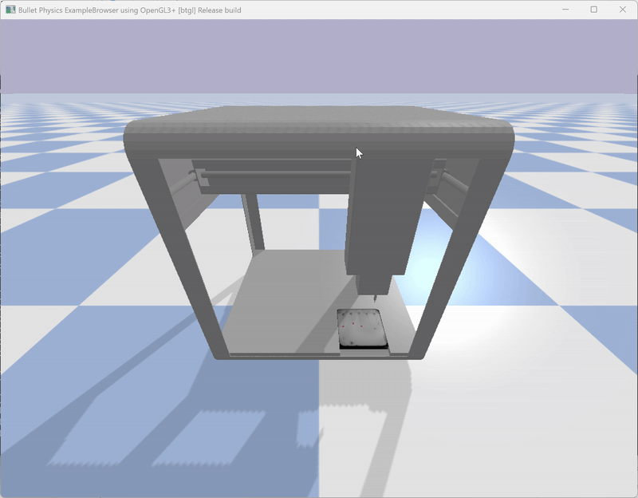

# Task 12–13: Integration & Benchmarking

This README documents the **end‑to‑end integration** of vision‑based root detection with **robot control**, and presents a **benchmarking comparison** between a classical **PID controller** and a learned **PPO controller**. It also explains the **coordinate transformations** used to convert image‑space detections into robot‑frame targets.

---




---

## 1. System Overview

The pipeline consists of three clearly separated phases:

1. **Vision Inference**
   A U‑Net model segments roots from a plate image and extracts root bottom points in pixel coordinates.

2. **Coordinate Transformation**
   Pixel‑space detections are mapped into real‑world robot coordinates (meters), accounting for scale, axis conventions, and plate offsets.

3. **Robot Control & Simulation**
   A 3‑axis linear robot is controlled in PyBullet using PID controllers to move the pipette to each target and perform a drop action.

This separation ensures modularity, reproducibility, and clear attribution of errors across the perception–control pipeline.

---

## 2. Phase 1 – Vision Inference

### 2.1 Decoupling of the CV Pipeline

To ensure robustness and maintainability, the **computer vision (CV) pipeline is intentionally decoupled** from control and benchmarking logic.

* All inference‑related functionality (mask prediction, preprocessing metadata, root bottom extraction) is imported via **stable interfaces**.
* Changes to the CV pipeline (e.g. retraining, preprocessing, architecture updates) do **not affect** the control or benchmarking code.
* The original CV codebase is maintained separately for vision‑specific experimentation and evaluation.

As a result:

* The integration pipeline depends only on **explicit outputs** (binary masks and pixel coordinates).
* Vision and control can be developed, debugged, and benchmarked **independently**.
* Benchmarking results remain reproducible even as the CV pipeline evolves.

### 2.2 Inference Output

* The simulation provides a **top‑down RGB image** of the plate.
* The image is cropped and resized during preprocessing.
* A trained **U‑Net** predicts a binary root segmentation mask.
* The **bottom point of each detected root** is extracted.

**Output:**

* A dictionary mapping root IDs to pixel coordinates `(col, row)` relative to the cropped image.

These coordinates are still **image‑space** and must be transformed before use by the robot controller.

---

## 3. Phase 2 – Coordinate Transformation

This phase converts image‑space detections into robot‑frame Cartesian targets.

### 3.1 Pixel Coordinate Convention

* Image origin: **top‑left corner**
* Pixel format: `(col, row)`

  * `col` → horizontal image axis
  * `row` → vertical image axis

### 3.2 Plate Scaling

The physical dimensions of the plate are known:

* Plate size: **150 mm × 150 mm**
* Cropped image width: `N` pixels

Scaling factor:

```text
mm_per_pixel = plate_size_mm / plate_size_pixels
```

This enables conversion from pixel distances to metric distances.

### 3.3 Image → Robot Axis Mapping

The image coordinate frame does **not** align directly with the robot frame.

Applied mapping:

* Image **row** → Robot **X**
* Image **column** → Robot **Y**

This corresponds to an effective **90° rotation** between image space and robot space.

In code:

```text
y_pixel, x_pixel = (col, row)
```

### 3.4 Pixel → Metric Conversion

1. **Pixels → millimeters**

```text
x_mm = x_pixel * mm_per_pixel
y_mm = y_pixel * mm_per_pixel
```

2. **Millimeters → meters**

```text
dx = x_mm / 1000
dy = y_mm / 1000
```

### 3.5 Plate Offset in Robot Frame

The plate has a fixed, calibrated position in the robot base frame:

```text
PLATE_POSITION_ROBOT = [x_plate, y_plate, z_plate]
```

Final robot target:

```text
x = x_plate + dx
y = y_plate + dy
z = constant approach height
```

This produces a full **3D Cartesian target** usable by the controller.

---

## 4. Phase 3 – Robot Control

### 4.1 Joint‑Space Representation

The robot is modeled as a **3‑axis Cartesian system** (X, Y, Z).

* Each joint represents linear motion along one axis.
* Helper functions convert between Cartesian targets and joint commands.

### 4.2 PID Control

* Independent PID controller for each axis (X, Y, Z)
* Velocity‑limited outputs for stability
* Controllers are reset between targets

Control loop:

1. Move toward the target
2. Wait until position and velocity thresholds are satisfied
3. Perform drop action
4. Proceed to the next target

---

## 5. State Machine

The simulation runs as a finite‑state machine:

* **MOVING** – PID drives the robot toward the target
* **DROPPING** – Pipette action is triggered
* **WAITING** – Stabilization delay
* **FINISHED** – All targets processed

This ensures deterministic and repeatable benchmarking behavior.

---

## 6. Benchmarking Setup

### 6.1 Controllers Evaluated

* **PID** – Hand‑tuned classical controller
* **PPO** – Reinforcement learning–based controller

### 6.2 Evaluation Metrics

* **Accuracy (mm)** – Euclidean distance between target and actual drop location
* **Execution Time (s)** – Time to reach the target within tolerance
* **Stability** – Variance of error across targets
* **Practical Usability** – Predictability, tuning effort, and real‑time suitability

All controllers were evaluated under identical simulation conditions.

---

## 7. Results

### 7.1 PID vs PPO Comparison

|   Point | PID Time (s) | PID Error (mm) | PPO Time (s) | PPO Error (mm) |
| ------: | -----------: | -------------: | -----------: | -------------: |
|       1 |        0.010 |         0.5592 |        0.031 |         1.2216 |
|       2 |        0.012 |         0.2738 |        0.016 |         1.1782 |
|       3 |        0.004 |         0.4536 |        0.032 |         1.0545 |
|       4 |        0.010 |         0.4425 |        0.007 |         1.1626 |
|       5 |        0.006 |         0.6846 |        0.625 |         1.6678 |
| **AVG** |    **0.008** |     **0.4827** |    **0.142** |     **1.2570** |

### 7.2 Observations

* **PID**

  * Lower average error
  * Highly consistent and predictable
  * Very fast convergence

* **PPO**

  * Higher average error
  * Larger variance in execution time
  * Occasional slow or unstable convergence

---

## 8. End‑to‑End Pipeline Accuracy

| Target | Time (s) | Target XY (m)    | Actual XY (m)    | Error (mm) |
| -----: | -------: | ---------------- | ---------------- | ---------: |
|      0 |     0.44 | [0.1733, 0.0833] | [0.1730, 0.0833] |     0.2873 |
|      1 |     0.80 | [0.1666, 0.1174] | [0.1667, 0.1171] |     0.2990 |
|      2 |     1.13 | [0.1706, 0.1403] | [0.1706, 0.1400] |     0.2976 |
|      3 |     1.46 | [0.1610, 0.1662] | [0.1611, 0.1659] |     0.3100 |
|      4 |     1.80 | [0.1624, 0.1961] | [0.1624, 0.1958] |     0.2960 |

* **Mean Error:** 0.2980 mm
* **Total Time:** 1.86 s

These results demonstrate **sub‑millimeter accuracy** across the full perception‑to‑control pipeline.

---

## 9. Conclusions & Recommendations

* PID provides a **strong and interpretable baseline**, with superior accuracy and speed under current conditions.
* PPO does not yet outperform PID for precise, short‑horizon positioning tasks.

**Recommended next steps:**

1. Use **PID** for short‑term deployment.
2. Improve RL performance via:

   * Longer training and curriculum learning
   * Improved reward shaping with explicit accuracy penalties
   * Exploring alternative algorithms (e.g. SAC)
3. Investigate **hybrid approaches** combining PID (low‑level control) with RL (high‑level planning or adaptation).
4. Extend benchmarks with noise, disturbances, and unseen target distributions.

---

**Key takeaway:** clean perception–control decoupling and explicit coordinate transforms enable reliable benchmarking and highlight the strengths of classical control for precision tasks.
